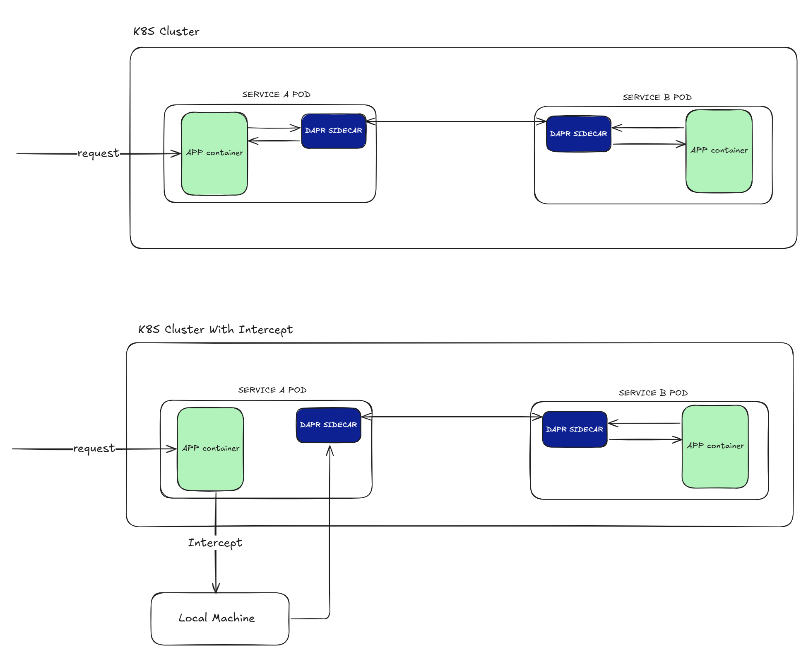

## Service 2 Service Communication Example

In this example we have two python microservices that are deployed inside a Kubernetes cluster and communicate with each other through the [Dapr](https://dapr.io/) API. Then we can use [Telepresence](https://www.getambassador.io/docs/telepresence/latest/quick-start) to intercept service A and modify the code.



## Prerequisites

You need the following tools installed on your local machine:
* [Azure CLI](https://learn.microsoft.com/en-us/cli/azure/install-azure-cli?view=azure-cli-latest)
* [Kubelogin (using azure cli)](https://azure.github.io/kubelogin/install.html#using-azure-cli)
* [Telepresence](https://www.getambassador.io/docs/telepresence/latest/install?os=gnu-linux)
* [Docker](https://www.docker.com/)

You need to follow the instructions provided by Azure to connect to the cluster. After you are connected to the cluster run a `telepresence connect` and make sure it is connected with the `telepresence status` command.

### Jetbrains IDE Plugin

You can also install [Telepresence plugin for Jetbrains IDEs](https://www.getambassador.io/docs/telepresence/latest/plugins/jetbrains) for a more seamless experience.

## How to Run

1. Apply the `deployment.yaml` and `istio.yaml` files
2. Check that a Dapr sidecar is injected on both services
   1. `kubectl get pods service-a-xxxxx -o jsonpath='{.spec.containers[*].name}'`
   2. `kubectl get pods service-b-xxxxx -o jsonpath='{.spec.containers[*].name}'`
3. Check that service A works `curl http://service-a.dev.platformeng.exus.co.uk/`

### Invoke Service B

```bash
curl -X POST http://service-a.dev.platformeng.exus.co.uk/invoke-service-b -H "Content-Type: application/json" \
     -d '{"message": "Hello from service-a"}'
```

If you get the following response: `{"data":{"message":"Hello from service-a"},"message":"Processed by service-b"}` this means service b is also running and communication between Dapr services is achieved.

## Telepresence

1. Make sure you are connected `telepresence connect`
2. Intercept service A and the Dapr api sidecar port `telepresence intercept service-a --port=5000:5000 --to-pod=3500`. You can add the intercept with the [Telepresence Jetbrains IDE Plugin](https://www.getambassador.io/docs/telepresence/latest/plugins/jetbrains#run-your-application) as well.
3. Run the python app locally `flask --app ./service-a/app.py --debug run`
4. You can `curl http://service-a.dev.platformeng.exus.co.uk/` and see the logs on your local flask app and also invoke service b the same way as the previous step
5. Do code changes

## FAQ

### Problems with Kubelogin installation

If you have `kubectl` installed on your local machine try `sudo rm /usr/local/bin/kubectl` to delete the link to the kubectl binary and then run `sudo az aks install-cli`


### Can i use Dapr locally for service A?

You can use Dapr locally for service A but the communication with the Dapr of service B **will not** work as Dapr services need to be running either locally or in the cloud.

### Can i use the Dapr API by targeting the Dapr service inside the cluster?

When intercepting service-a and define `DAPR_URL = "http://service-a-dapr.default.svc.cluster.local:3500"`
This won't work as DAPR is a **headless service** 


#### Solution

1. Your local service-a should send requests to the Dapr sidecar in the cluster.
2. The Dapr sidecar in service-a will invoke service-b via the Dapr API inside the cluster.

Since service-a is running locally, it does not have direct access to the Dapr sidecar running inside the cluster. You need to expose the Dapr API of service-a inside the cluster to your local machine.

Thats why on the telepresence intercept command we use the `--to-pod=3500` flag so we expose the Dapr API to our local machine.

You can also use `kubectl port-forward service-a-xxxxx 3500:3500 -n default`